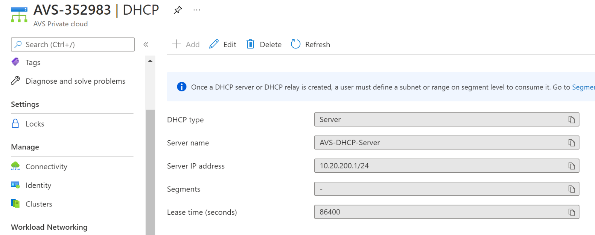
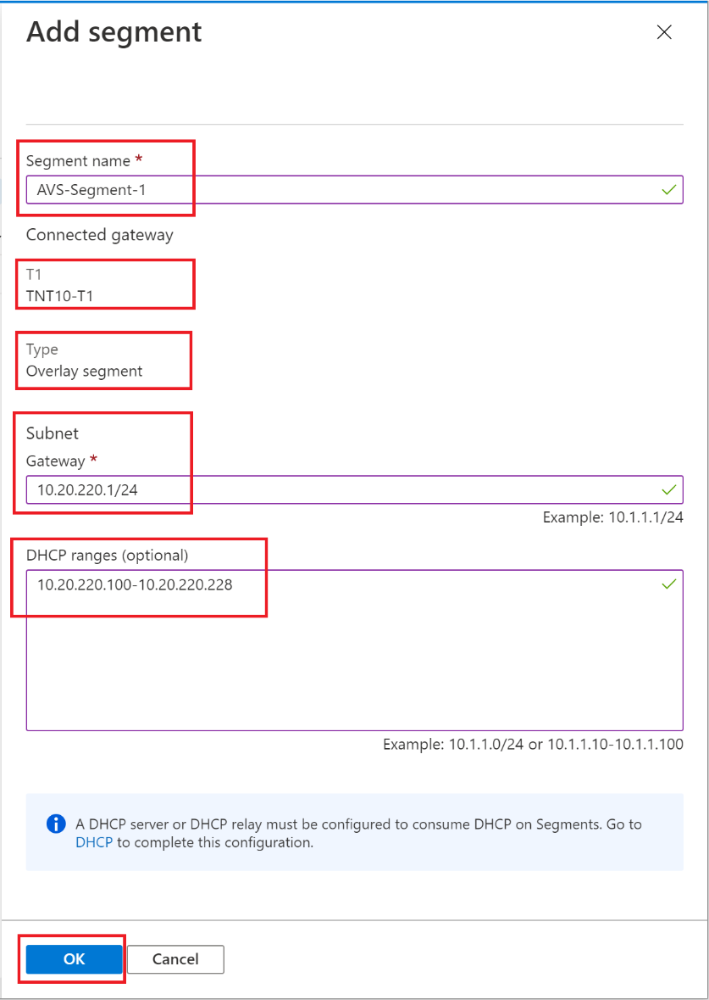
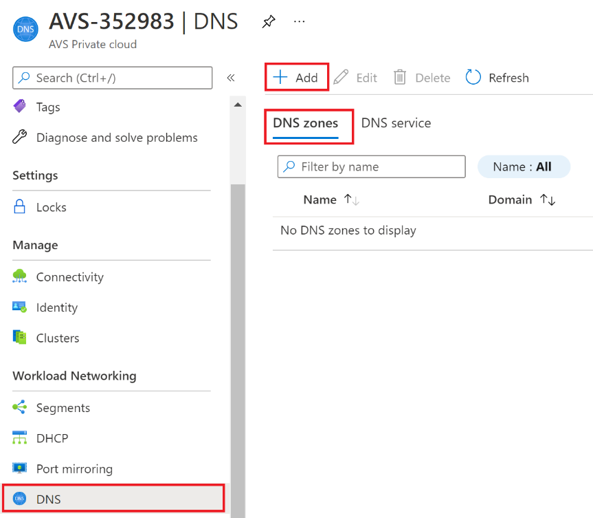
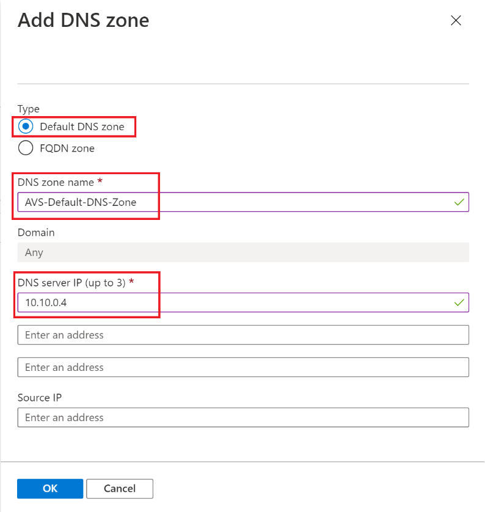
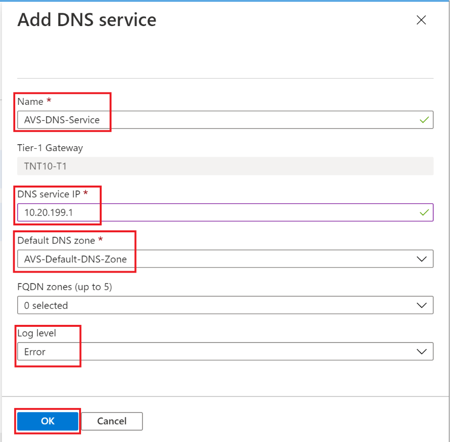
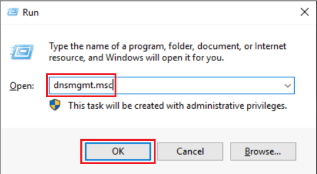
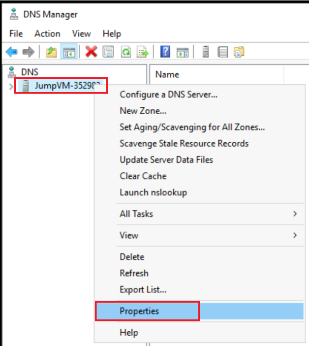
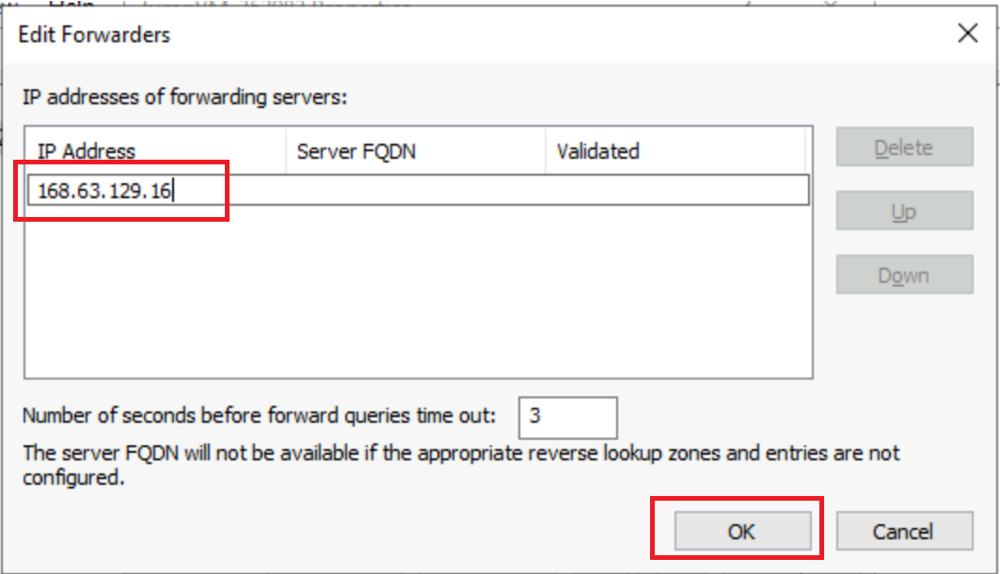
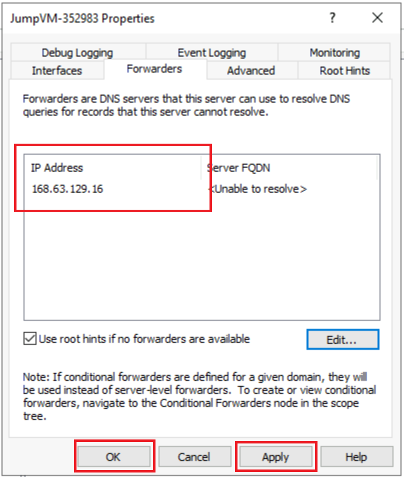

# LAB3 – Initial NSX-T configuration

## Create DHCP Server from Azure portal

You will create a DHCP server or relay directly from the Azure VMware Solution
blade in the Azure portal. The DHCP server or relay connects to the Tier-1
gateway, which gets created when you deploy Azure VMware Solution. All the
segments where you gave DHCP ranges will be part of this DHCP. After you've
created a DHCP server or DHCP relay, you must define a subnet or range on
segment level to consume it.

1. In your Azure VMware Solution Private Cloud, under **Workload Networking**,
   select **DHCP** \> **Add**.
   

2. You can select either DHCP Server or DHCP Relay, but in this lab, you’ll
   need to choose **DHCP Server** and then provide a name for the server IP
   addresses, for example 10.20.200.1/24. Next, click on **OK**.

   

3. It takes few seconds to complete, after that you’ll see the configuration as
   in the screenshot below.
      
  
   

## Create NSX network segment from Azure portal

You will create and configure an NSX-T segment from the Azure VMware Solution
blade in the Azure portal. These segments are connected to the default Tier-1
gateway, and the workloads on these segments get East-West and North-South
connectivity. Once you create the segment, it displays in NSX-T Manager and
vCenter.

1. In the Azure VMware Solution Private Cloud, under **Workload Networking**,
   select **Segments** \> **Add**. Provide the details for the new logical
   segment and select **OK**.
    

2. Provide the details for the new logical segment and select
   **OK**.

    

3. **Segment name** - Name of the logical switch that is visible in vCenter,
   i.e., **AVS-Segment-1**

4. **Subnet gateway** - Gateway IP address for the logical switch's subnet with
   a subnet mask. VMs are attached to a logical switch, and all VMs connecting
   to this switch belong to the same subnet. Also, all VMs attached to this
   logical segment must carry an IP address from the same segment.

5. **Connected gateway** - *Selected by default and read only.* Tier-1 gateway
   and type of segment information.

   1. **T1** - Name of the Tier-1 gateway in NSX-T Manager. An Azure VMware
      Solution Private Cloud comes with an NSX-T Tier-0 gateway in
      Active/Active mode and a default NSX-T Tier-1 gateway in Active/Standby
      mode. Segments created through the Azure VMware Solution blade only
      connect to the default Tier-1 gateway, and the workloads of these
      segments get East-West and North-South connectivity. You can only create
      more Tier-1 gateways through NSX-T Manager. Tier-1 gateways created from
      the NSX-T Manager portal are not visible in the Azure VMware Solution
      blade.
  
   2. **Type** - Overlay segment supported by Azure VMware Solution.

6. **DHCP** (optional) - DHCP ranges for a logical segment. A [DHCP server or
   DHCP relay](https://docs.microsoft.com/en-us/azure/azure-vmware/configure-nsx-network-components-azure-portal#create-a-dhcp-server-or-dhcp-relay-in-the-azure-portal)
   must be configured to consume DHCP on Segments.
  
   **The segment is now visible in the Azure VMware Solution blade, NSX-T
   Manger, and vCenter**
    

## Configure DNS from Azure portal

You'll configure a DNS forwarder where specific DNS requests get forwarded to a
designated DNS server for resolution. A DNS forwarder is associate with a
**default DNS zone** and up to three **FQDN zones**.

You can also use the [NSX-T Manager portal (through the Jumpbox) to configure a
DNS
forwarder](https://docs.vmware.com/en/VMware-NSX-T-Data-Center/2.5/administration/GUID-A0172881-BB25-4992-A499-14F9BE3BE7F2.html).

To set up a DNS forwarder in the Azure VMware Solution blade in Azure Portal,
you'll:

- [Step 1. Configure a default DNS zone and FQDN
  zone](https://docs.microsoft.com/en-us/azure/azure-vmware/configure-nsx-network-components-azure-portal#step-1-configure-a-default-dns-zone-and-fqdn-zone)
  – When a DNS query is received, a DNS forwarder compares the domain name
  with the domain names in the FQDN DNS zone.

- [Step 2. Configure DNS
  service](https://docs.microsoft.com/en-us/azure/azure-vmware/configure-nsx-network-components-azure-portal#step-2-configure-dns-service)
  \- You'll configure the DNS forwarder service.

### Step 1 - Configure a default DNS zone and FQDN zone

You'll configure a default DNS zone and FQDN zone to send DNS queries to the
upstream server. When a DNS query is received, the DNS forwarder compares the
domain name in the query with the FQDN DNS zones' domain names. If a match is
found, the query is forwarded to the DNS servers specified in the FQDN DNS zone.
If no match is found, the query is forwarded to the DNS servers specified in the
default DNS zone.

*A default DNS zone must be defined before you configure an FQDN zone.*

1. In your Azure VMware Solution Private Cloud, under **Workload Networking**,
   select **DNS** \> **DNS zones** \> **Add**.

   

2. Select **Default DNS zone** and provide:

   1. DNS zone name.

   2. DNS server IP, this will be the Jumpbox IP address that you can get from
      the Azure Portal or from the VM directly once you Bastion/RDP into it.
      **You will be using the Jumpbox as a DNS Forwarder just for the lab
      purposes, that won’t be practical in production scenarios.**

      

3. Click **OK**, and it will take few seconds to complete.

   

   

### Step 2 - Configure DNS service

1. After you created the DNZ Zone, now you will be able to create the **DNS
   Service**. Click on the **DNS Service** tab and click **+ Add**. Fill out
   the required fields:

   1. **Name**

   2. **Tier-1 Gateway** (A Tier-1 Gateway is selected by default and reflects
      the gateway created when deploying Azure VMware Solution.)

   3. **DNS Service IP** (that’s what the VMs will use to connect to the DNS
      Service)

   4. **Default DNS Zone** (that’s the zone you created in the previous step)

   5. **FQDN zone** (you don’t need to specify any for this lab)

   6. **Log level** (Error level is good enough for this lab)  
      

2. After few seconds, the DNS Service will be created, and you’ll see a
   notification saying:

    

### Step 3 - Configure DNS Forwarder

DNS Forwarder is needed to forward DNS queries from VMs hosted in AVS Private
Cloud to Azure DNS virtual server (168.63.129.16) to resolve Azure deployed
resources through Azure Private DNS Zones. For more details, check this out:
[What is IP address
168.63.129.16?](https://docs.microsoft.com/en-us/azure/virtual-network/what-is-ip-address-168-63-129-16)

1. Connect to the Jumpbox VM that’s hosted on Azure IaaS by leveraging Azure
   Bastion.

2. Go to DNS MMC Snap-in. You can do that by going to **Run** tool, and type:
   **dnsmgmt.msc**, then click on **OK**.

   

3. Expand the DNS root, right click on the DNS Instance, and go to
   **Properties**.

    

4. Go to **Forwarders** tab and click on **Edit…**.  
  
    

5. Add this IP address **168.63.129.16**, then click **OK**.

    

6. Back to the **Properties** dialog, you can click **Apply**, then **OK** to
   exit. This should be good enough to configure the Jumpbox as a DNS
   Forwarder.
   

    **\*You will test the DNS Forwarding functionality in the upcoming labs, once you
    create a Storage Account that’s associated with Azure Private Endpoint and
    deploy a VM in AVS Private Cloud. Once we have that setup, you can try to
    resolve the IP address of the Storage account, and you should get a private IP
    address not a public one.**

## Next Steps

[Back to Table of Content](index.md#table-of-contents)

[Lab 4](lab-4.md)
